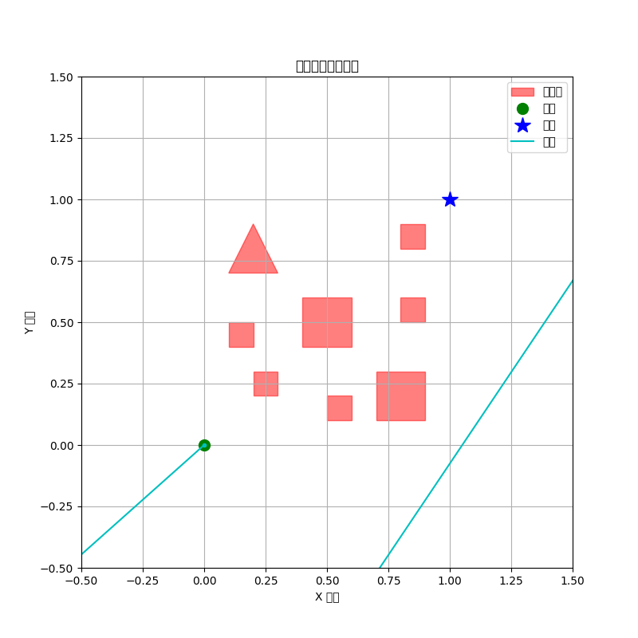

# robotics-brain
Repository for developing a state-of-the-art robotics brain using open-source models and innovative algorithms, with documentation and research papers.

## Overview

This project aims to build the next-generation robotics brain by leveraging state-of-the-art open-source models and by developing novel algorithms for perception, planning, control and learning.

This repository contains a prototype implementation of a **GPU-accelerated motion planner** for a 2D navigation task. The planner, inspired by recent research in parallelized plan sampling and refinement, uses `torch` to evaluate thousands of potential action sequences on a GPU. It refines the best candidate plan using gradient-based optimization through a differentiable dynamics model. This approach allows for rapid generation of collision-free paths in environments with static obstacles.

The current implementation includes:
- A `RobotBrain` class that orchestrates the planning process.
- A `GPUParallelPlanner` that samples and refines motion plans.
- A differentiable 2D environment with a dynamics model for simulation.
- Visualization tools to plot the resulting plan.

### Research Directions

This project will continue to investigate new algorithms and methods, including but not limited to:

1. **Hybrid VLA‑Diffusion Architectures:** Combining the semantic understanding of VLA models with the precision control of diffusion policies for improved dexterity and robustness.
2. **Hierarchical World‑Models with Language Interface:** Building latent dynamics models that can be queried and updated via natural language.
3. **Self‑Improving Generalist Agents:** Developing mechanisms for agents to automatically collect new data and self‑train.
4. **Multi‑Agent Collaboration:** Exploring coordination strategies for teams of robots.
5. **Safety‑Aware Planning and Execution:** Integrating formal safety constraints and uncertainty estimation into the planning loop.

The **papers** directory will contain drafts and notes for original research papers arising from these directions.

## Getting Started

This project requires Python, `torch`, and `matplotlib`. For best performance, a NVIDIA GPU with CUDA is recommended.

### Installation

1. Clone the repository:
   ```bash
   git clone https://github.com/your-username/robotics-brain.git
   cd robotics-brain
   ```

2. Install the required dependencies:
   ```bash
   pip install -r requirements.txt
   ```

### Running the Demo

To run the 2D planning demo, execute the `main.py` script:

```bash
python main.py
```

The script will default to using a CUDA device if available. To run on a CPU, use the `--device` flag:
```bash
python main.py --device cpu
```
Note: Running on CPU is significantly slower and uses less complex planner settings.

The script will:
1. Set up a 2D environment with a start point, a goal, and several obstacles.
2. Initialize the `GPUParallelPlanner`.
3. Run the planner to find a collision-free path.
4. Print the final action plan to the console.
5. Save a visualization of the plan as `plan_visualization.png` in the root directory.

Here is an example of the output visualization:



## Contributions

Contributions are welcome. Please open an issue or pull request if you have ideas, find issues, or want to contribute to the research directions.
