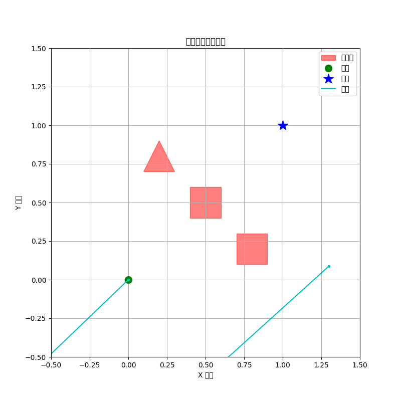

# robotics-brain
一个使用开源模型和创新算法开发最先进的机器人大脑，并包含文档和研究论文的存储库。

## 概述

本项目旨在利用最先进的开源模型，并通过开发新颖的感知、规划、控制和学习算法，来构建下一代机器人大脑。

本存储库包含一个用于2D导航任务的 **GPU加速运动规划器** 的原型实现。该规划器受到并行化计划采样和优化最新研究的启发，使用 `torch` 在GPU上评估数千个潜在的动作序列。它通过一个可微的动力学模型，使用基于梯度的优化方法来改进最佳候选计划。这种方法可以在具有静态障碍物的环境中快速生成无碰撞的路径。

当前实现包括：
- 一个 `RobotBrain` 类，用于协调规划过程。
- 一个 `GPUParallelPlanner` 类，用于采样和优化运动计划。
- 一个带有动力学模型的可微2D环境，用于仿真。
- 用于绘制最终计划的可视化工具。

### 研究方向

本项目将继续研究新的算法和方法，包括但不限于：

1. **混合VLA-扩散架构：** 结合VLA模型的语义理解能力和扩散策略的精确控制，以提高灵活性和鲁棒性。
2. **带语言接口的层级式世界模型：** 构建可通过自然语言查询和更新的潜在动力学模型。
3. **自我提升的通用智能体：** 开发智能体自动收集新数据和自我训练的机制。
4. **多智能体协作：** 探索机器人团队的协调策略。
5. **安全感知的规划与执行：** 将形式化的安全约束和不确定性估计整合到规划循环中。

**papers** 目录将包含由这些研究方向产生的原创研究论文的草稿和笔记。

### 论文

- **[Cross-Modal Diffusion Control for Robotic Manipulation](./papers/diffusion_policy_control/)**: 引入了一个用于机器人操作的框架，该框架使用扩散策略整合视觉、触觉和本体感觉输入，以提高在富接触任务中的性能。
- **[Height-Dimension Neural Networks for Robotic Control](./papers/height_dimension_network/)**: 提出使用具有垂直、层内连接的高度维度神经网络（HD-Nets），以增强机器人感知和控制的时间推理与记忆能力。
- **[A Hierarchical Foundation Model for Generalist Robots](./papers/hierarchical_foundation_model/)**: 提出了一个分层模型，将高层的、与形态无关的任务规划与底层的、特定于形态的运动控制分离，以创建通用型机器人。
- **[Online LENS: Neuromorphic Navigation with On-the-Fly Map Building](./papers/lens_navigation/)**: 扩展了LENS系统，通过使用事件相机和脉冲关联记忆，实现在新环境中的在线地图构建和传感器融合，以进行自主导航。
- **[Lifelong Dreamer: A World Model for Continual Reinforcement Learning](./papers/lifelong_world_model_rl/)**: 将Dreamer风格的世界模型与非参数化知识空间相结合，以实现持续学习，使智能体能够在整个生命周期内积累和重用技能。
- **[Adaptive Lp-Convolution for Robust Robotic Vision](./papers/lp_convolution_vision/)**: 提出使用能够动态改变卷积核形状的Lp-Convolution，以创建更强大、更高效的机器人视觉系统，从而适应多样化和充满挑战的真实世界场景。
- **[Learning to Collaborate: A Multi-Agent Cognitive Graph for Embodied AI](./papers/multi_agent_cognitive_graph/)**: 引入了一个使用动态图和图神经网络（GNN）的框架，使机器人团队能够学习协调的、协作的行为。
- **[Neuromorphic SLAM: Continuous Learning with Spiking Neural Networks](./papers/snn_navigation/)**: 提出了一种使用脉冲神经网络（SNNs）和事件相机的SLAM系统，通过脉冲时间依赖可塑性（STDP）实现对环境地图的连续在线学习。
- **[Adaptive Swarm Control for Cyborg Insects](./papers/swarm_control/)**: 提出了一个具有动态领导者选举和分散式学习协调功能的生物机器人集群框架，以创建更稳健、更有弹性、更高效的集群来完成复杂任务。

## 入门指南

本项目需要 Python、`torch` 和 `matplotlib`。为获得最佳性能，建议使用带CUDA的NVIDIA GPU。

### 安装

1. 克隆存储库：
   ```bash
   git clone https://github.com/your-username/robotics-brain.git
   cd robotics-brain
   ```

2. 安装所需的依赖项：
   ```bash
   pip install -r requirements.txt
   ```

3. **安装Webots模拟器：**
   本项目使用[Webots](https://cyberbotics.com/)进行虚拟测试。请从[官方网站](https://cyberbotics.com/#download)下载并安装Webots。
   Python `controller` API是Webots安装的一部分。

### 运行演示

#### 2D环境

要运行2D规划演示，请执行 `main.py` 脚本：
```bash
python main.py --environment 2d
```
默认情况下，这将使用一个固定的环境。要在一个随机生成的环境中测试规划器，请使用 `--random-env` 标志：
```bash
python main.py --environment 2d --random-env
```
此功能，称为**域随机化**，对于测试机器人在各种场景下的鲁棒性至关重要。

#### Webots环境

要运行Webots仿真，只需在终端中运行以下命令：
```bash
python main.py --environment webots
```
脚本现在将**自动启动Webots模拟器**。您不再需要手动打开它。

要在没有GUI的情况下运行（例如，在服务器上），请使用 `--headless` 标志：
```bash
python main.py --environment webots --headless
```

该脚本将：
1. 启动一个新的Webots仿真实例。
2. 连接到仿真，并使用规划器计算路径。
3. 在仿真结束时自动关闭Webots。

以下是输出可视化的一个示例：



## 贡献

欢迎贡献。如果您有想法、发现问题或希望为研究方向做出贡献，请创建 issue 或 pull request。
